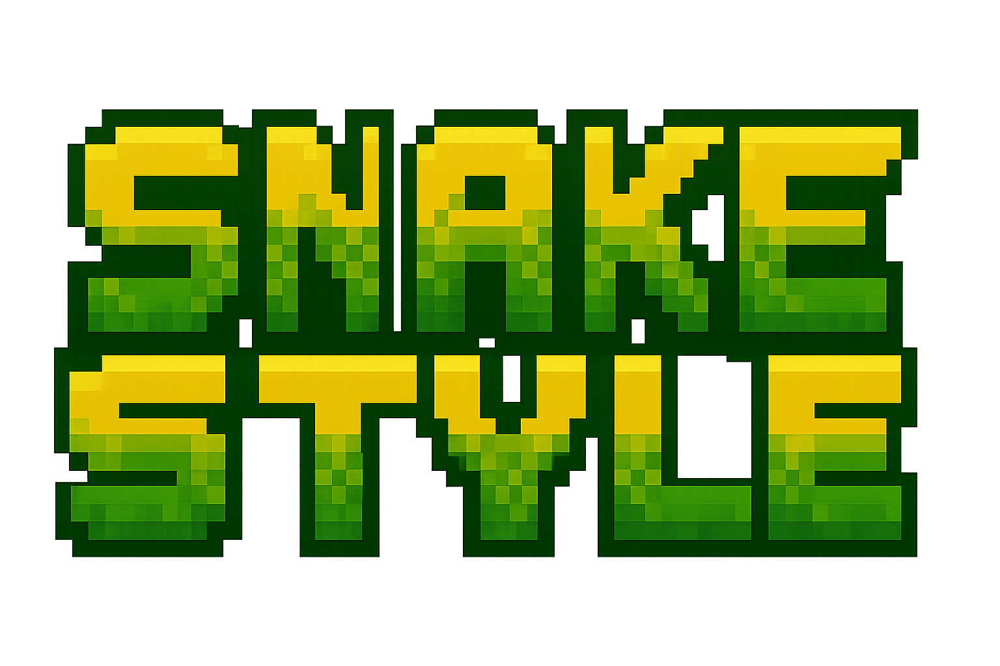

# Snake Style 🐍⚔️

**Version 0.3.1** - A swamp-based 2-player cooperative beat 'em up arcade game

Fight alongside your friend as serpent warriors defending the swamp from endless waves of hostile frogs!



## 🎮 Game Features

### Core Gameplay
- **2-Player Cooperative Action** - Team up locally to defeat waves of enemies
- **Wave-Based Combat** - Survive increasingly difficult frog invasions
- **Combo System** - Chain attacks together for massive score multipliers
- **Multiple Enemy Types** - Small, medium, and boss-sized frogs with unique behaviors
- **Dynamic Water Mechanics** - Jump between lily pads or swim through the swamp
- **Retro Pixel Art** - Beautiful hand-crafted sprites and animations

### Combat Moves
Each snake warrior has two powerful attacks:

- **🌀 Roll Attack (F/K)** - Spin into a defensive ball and crash through enemies
  - Deals 25 damage
  - Grants temporary invulnerability
  - Perfect for escaping tight situations

- **🦎 Tongue Grab (G/L)** - Extend your tongue to grab and throw enemies
  - Grab enemies from a distance
  - Hold them in place
  - Throw for 35 damage with knockback
  - Great for crowd control

## 🕹️ Controls

### Player 1 (Green Snake)
- **Movement**: `W` `A` `S` `D`
- **Roll Attack**: `F`
- **Grab Attack**: `G`

### Player 2 (Orange Snake)
- **Movement**: Arrow Keys `↑` `←` `↓` `→`
- **Roll Attack**: `K`
- **Grab Attack**: `L`

### Mobile Touch Controls
- **Virtual Joysticks** - On-screen joysticks for movement
- **Action Buttons** - Touch-friendly buttons for attacks

## 🎯 How to Play

1. **Start the Game** - Click "Start Game" on the title screen
2. **Survive the Waves** - Defeat all frogs to progress to the next wave
3. **Build Combos** - Attack enemies in quick succession to multiply your score
4. **Use the Environment** - Jump on lily pads to avoid the water and gain tactical advantage
5. **Coordinate Attacks** - Work with your partner to overwhelm enemy groups
6. **Watch Your Health** - Avoid frog attacks and use invulnerability frames wisely

## 🏆 Scoring System

- **Small Frog**: 10 points base
- **Medium Frog**: 25 points base
- **Large Boss Frog**: 50 points base
- **Combo Multiplier**: Each consecutive hit multiplies damage dealt into score
- **Wave Bonus**: Points increase with each wave survived

## 🌊 Game Mechanics

### Water Physics
- **Swimming**: Slower movement and reduced jump height in water
- **Lily Pads**: Platforms that gently bob on the water surface
- **Water Jumping**: Reduced jump power when submerged

### Enemy AI
- **Target Seeking**: Frogs jump toward the nearest player
- **Attack Pattern**: Different frog types have varying jump speeds and damage
- **Boss Behavior**: Large frogs are tankier but slower

### Health System
- Players start with 100 HP
- Invulnerability frames after taking damage
- Visual health bars show current HP for each player
- Game over when both players are defeated

## 🚀 Running the Game

### Local Development
```bash
npm start
```
Then open your browser to `http://localhost:1990`

### Alternative Method
```bash
npx http-server -p 8080
```
Or simply open `index.html` in a modern web browser.

## 📁 Project Structure

```
snakez/
├── index.html          # Main game page
├── game.js            # Game logic and mechanics
├── style.css          # UI styling
├── graphics/          # All game sprites and images
│   ├── logo_title.png
│   ├── snake_p1_*.png     # Player 1 sprites
│   ├── snake_p2_*.png     # Player 2 sprites
│   ├── frog_*.png         # Enemy sprites
│   ├── lilypad_*.png      # Platform sprites
│   ├── effect_*.png       # Visual effects
│   └── ui_*.png           # UI elements
└── package.json       # Project metadata
```

## 🎨 Graphics

All pixel art graphics are located in the `/graphics` folder:

- **23 unique sprites** covering all game elements
- **Multiple animation states** for characters
- **Visual effects** for impacts, combos, and water splashes
- **Custom UI elements** for health bars and combo indicators

## 🔧 Technical Details

- **Pure JavaScript** - No frameworks or dependencies
- **HTML5 Canvas** - Hardware-accelerated 2D rendering
- **Responsive Design** - Works on desktop and mobile devices
- **60 FPS Target** - Smooth gameplay with requestAnimationFrame
- **Asset Preloading** - All graphics loaded before game start

## 📝 Version History

### v0.3.1 (Current)
- 🎨 Rebranded game from "Snake Warriors" to "Snake Style"
- ✨ Updated start button text to "Slither In"
- ✨ Added Player 2 jumping sprite integration
- 🐛 Fixed frog sprite flickering at jump peak - now uses stable ground detection
- 🐛 Fixed frog sprite jittering when landing in water - added 3-frame stabilization
- 🎨 Increased small jumping frog sprite size (40px → 50px) for better visibility
- ⌨️ Added Enter key support to start game from title screen

### v0.3.0
- 🐛 Fixed sprite sizing issues - all sprites now display at correct entity dimensions
- 🐛 Fixed sprite flickering on lily pads - improved collision detection with tolerance for bobbing
- 🐛 Fixed water detection - snakes on lily pads are never marked as swimming
- 🐛 Fixed missing P2 jumping sprite - uses idle sprite as fallback
- 🐛 Fixed missing P1 swimming sprite - uses idle sprite with 1.5x size multiplier
- 🎨 Improved lily pad visuals - increased height (15→25px) and reduced bobbing motion
- 💻 Added desktop control hints - keyboard controls displayed at bottom of game screen
- 📱 Improved responsive design - mobile controls hidden on desktop, desktop controls hidden on mobile
- 🎨 Enhanced swimming sprites - 50% larger for better visibility in water

### v0.2.0
- ✨ Added complete pixel art sprite system
- ✨ Integrated 23 custom graphics for all game elements
- ✨ Implemented sprite-based animations for all characters
- ✨ Added title screen with custom logo and background
- ✨ Created asset loading system with fallback support
- 🎨 Enhanced visual presentation with swamp theme
- 📱 Maintained mobile touch control support

### v0.1.0
- 🎮 Initial release with core gameplay
- 👥 2-player local multiplayer
- 🌊 Basic water and lily pad mechanics
- 🐸 Three frog enemy types
- 💥 Roll and grab attack systems
- 🏆 Combo and scoring system

## 🎮 Game Tips

1. **Combo Mastery** - Keep your combo going by attacking continuously
2. **Roll for Safety** - Use roll attack to escape when surrounded
3. **Grab Strategy** - Pull enemies away from your partner
4. **Platform Advantage** - Fight on lily pads to avoid water slowdown
5. **Team Coordination** - One player grabs while the other rolls through
6. **Boss Focus** - Prioritize large frogs to prevent being overwhelmed

## 🐛 Known Issues

- None reported yet! Please submit any bugs you find.

## 📜 License

MIT License - Feel free to modify and share!

## 🙏 Credits

- Game Design & Programming: [Your Name]
- Pixel Art Graphics: Custom designed
- Sound Effects: TBD
- Music: TBD

---

**Enjoy the game!** 🐍🎮🐸

For issues, feedback, or contributions, please visit the project repository.
